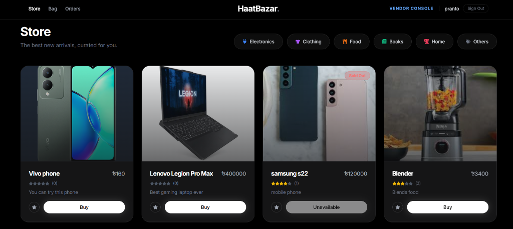
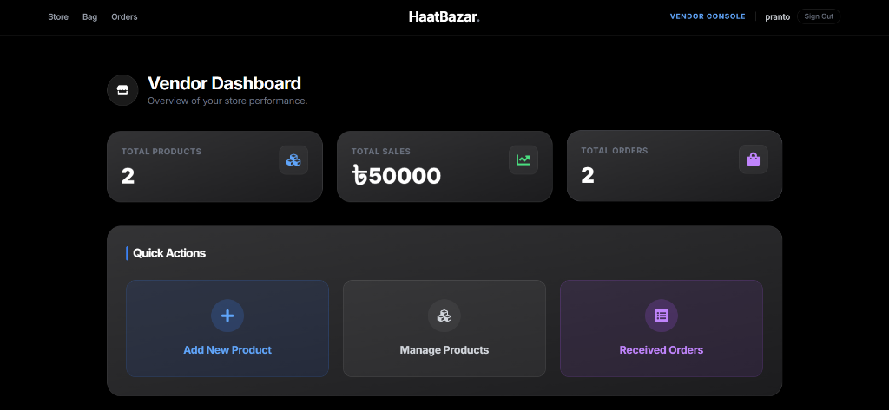
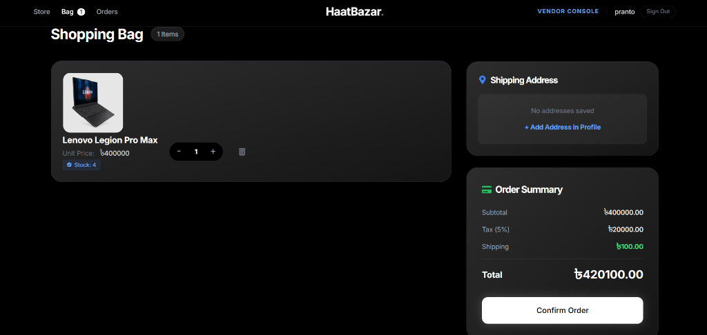
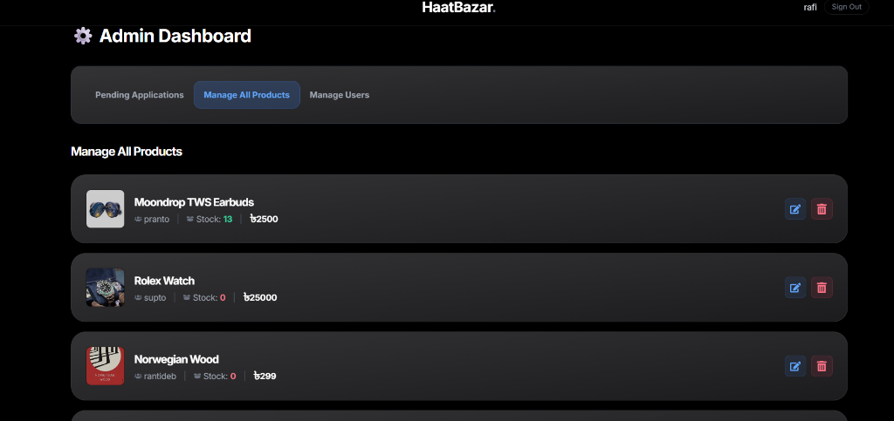

# HaatBazar — Multi-Vendor E-Commerce Platform

[](https://cse-250.vercel.app/)
[](https://reactjs.org/)
[](https://nodejs.org/)
[](https://www.mongodb.com/)
[](https://tailwindcss.com/)
[](https://stripe.com/)
[](LICENSE)

**HaatBazar** is a production-ready, full-stack multi-vendor e-commerce web application built on the **MERN** stack (MongoDB, Express.js, React 19, Node.js). Engineered with a **dark-mode first, glassmorphism UI**, role-based access control (Super Admin, Merchant Vendor, Customer), Stripe sandbox card checkout, and real-time inventory management.

---

## 🚀 Live Demo & 1-Click Demo Credentials

🌐 **Live Application URL:** [https://cse-250.vercel.app/](https://cse-250.vercel.app/)

> **Interactive Demo:** Access all 3 roles instantly using the built-in **"1-Click Test"** buttons on the Login page without needing to register or fill out forms.


| Role | Dashboard URL | Demo Credentials | Capabilities |
| :--- | :--- | :--- | :--- |
| **Super Admin** | `/admin/dashboard` | `admin@haatbazar.com` / `password123` | Platform analytics, verify vendor applications, content moderation, order overview |
| **Merchant Vendor** | `/vendor/dashboard` | `vendor@haatbazar.com` / `password123` | Inventory CRUD, product image uploads (Cloudinary), order processing & fulfillments |
| **Shopper / Customer** | `/dashboard` | `customer@haatbazar.com` / `password123` | Product search & filters, shopping bag, Stripe card checkout, interactive order tracking |

---

## 🌟 Key Features

### 🛒 Customer Experience
* **Dark-Mode Glassmorphism UI:** Built with Tailwind CSS, Framer Motion, and GSAP micro-animations.
* **Product Catalog & Filtering:** Search, category browsing, price range filtering, and customer review summaries.
* **Real-Time Shopping Bag:** Redux Toolkit state with automatic on-mount stock verification and quantity adjustment.
* **Stripe Payment Gateway:** Integrated payment processing endpoint (`/api/v1/payment/process`) supporting card transactions & Cash on Delivery (COD).
* **Interactive Order Tracking:** Step-by-step visual order timeline (`Placed` ➔ `Processing` ➔ `Shipped` ➔ `Delivered`).
* **Customer Profile & Address Book:** Multiple delivery addresses management and verified review submissions.

### 🏪 Vendor Ecosystem
* **Vendor Console:** Dedicated portal for merchant sellers.
* **Inventory Management:** Full product lifecycle management with Cloudinary multi-image hosting.
* **Order Management & Fulfillment:** Track customer orders per vendor and update delivery states.
* **Seller Analytics:** Revenue tracking, order counts, and inventory status breakdown.

### 🛡️ Super Admin Control
* **Central Command Center:** Real-time platform health metrics, sales figures, and user count.
* **Vendor Onboarding & Verification:** Review business applications, tax IDs, and approve/reject merchants.
* **Global Product Moderation:** Oversee and moderate all marketplace listings.

---

## 📸 Platform Previews

| Customer Store | Vendor Dashboard |
| :---: | :---: |
|  |  |

| Shopping Bag & Checkout | Admin Dashboard |
| :---: | :---: |
|  |  |

---

## 🏗️ Architecture & Tech Stack

```
HaatBazar Architecture
├── Frontend (React 19 + Vite)
│   ├── State: Redux Toolkit (authSlice, cartSlice, productSlice)
│   ├── UI / Animation: Tailwind CSS, Framer Motion, GSAP, React Hot Toast
│   └── Routing: React Router DOM v7 (Role-Guarded PrivateRoutes)
│
└── Backend (Node.js + Express REST API)
    ├── Auth & Security: JWT Authentication, HttpOnly Cookies, Bcrypt Password Hashing
    ├── Database & ODM: MongoDB Atlas + Mongoose
    ├── Payments: Stripe PaymentIntents API (with Webhook-ready handlers)
    ├── Media: Cloudinary CDN for Product & Avatar Storage
    └── Mail Service: Nodemailer SMTP for transactional notices
```

---

## 📦 Installation & Setup

### Prerequisites
* **Node.js:** v18.0.0 or higher
* **MongoDB:** Local instance or MongoDB Atlas Cluster
* **Git**

### 1. Clone the Repository
```bash
git clone https://github.com/xy3m/HaatBazar.git
cd HaatBazar
```

### 2. Install Dependencies
```bash
# Install backend dependencies (root)
npm install

# Install frontend dependencies
cd frontend
npm install
cd ..
```

### 3. Configure Environment Variables
Create a `backend/config/config.env` file (or `.env` in the root) with the following parameters:

```env
PORT=4000
NODE_ENV=development
DB_URI=mongodb+srv://<username>:<password>@cluster.mongodb.net/haatbazar?retryWrites=true&w=majority

# JWT Authentication
JWT_SECRET=your_jwt_secret_key_here
JWT_EXPIRE=7d
COOKIE_EXPIRE=7

# Stripe Payments (Sandbox or Live)
STRIPE_API_KEY=pk_test_your_stripe_publishable_key
STRIPE_SECRET_KEY=sk_test_your_stripe_secret_key

# Cloudinary Media Storage
CLOUDINARY_NAME=your_cloudinary_name
CLOUDINARY_API_KEY=your_cloudinary_key
CLOUDINARY_API_SECRET=your_cloudinary_secret

# SMTP Email Notifications (Optional)
SMPT_SERVICE=gmail
SMPT_MAIL=your_email@gmail.com
SMPT_PASSWORD=your_app_password
SMPT_HOST=smtp.gmail.com
SMPT_PORT=465

# Frontend URL (For CORS)
FRONTEND_URL=http://localhost:5173
```

### 4. Run Locally
Run both client and server concurrently with a single command:
```bash
npm run dev
```

* **Frontend:** `http://localhost:5173`
* **Backend API:** `http://localhost:4000`
* **API Health Check:** `http://localhost:4000/api/v1/health`

---

## 🧪 Testing & Verification

* **Health Endpoint:** `GET /api/v1/health` returns MongoDB connection state and server heartbeat.
* **Role Verification:** Test 1-click logins on `/login` to verify role guards for `/admin/dashboard`, `/vendor/dashboard`, and `/dashboard`.

---

## 📄 License
This project is licensed under the [ISC License](LICENSE).
